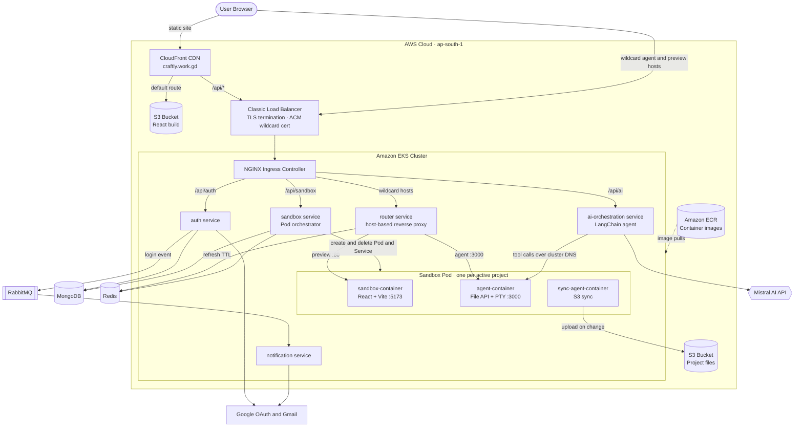
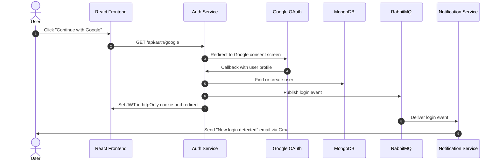
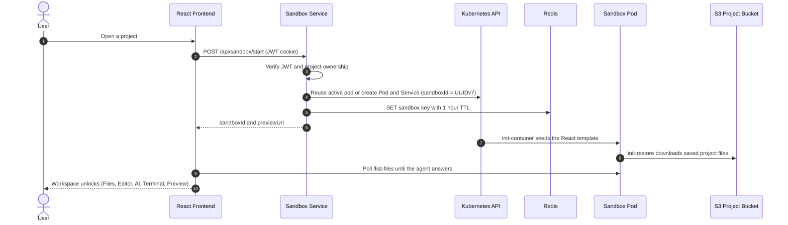
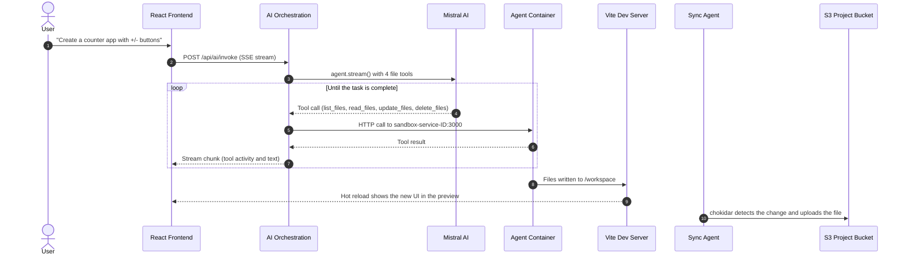
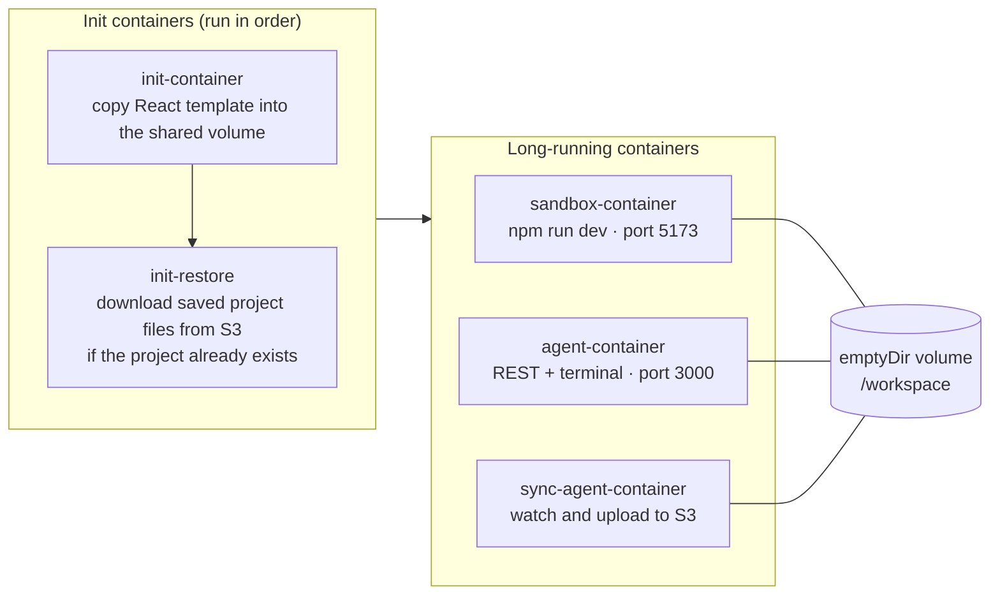
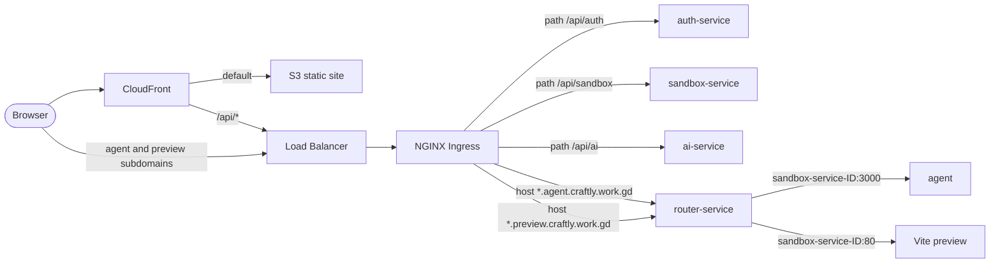

<div align="center">

# ⚡ Craftly — AI Web-App Builder

**Describe an app in plain English. Craftly's AI agent builds it live inside an isolated, per-project cloud sandbox — with a code editor, terminal and instant preview.**

[**🌐 Live Demo**](https://www.craftly.work.gd/) · [**💼 LinkedIn**](https://www.linkedin.com/in/vivek-channe/) · [**📦 Repository**](https://github.com/vivekchanne06-web/Craftly)


</div>

---

## 📑 Table of Contents

1. [Overview](#-overview)
2. [Demo](#-demo)
3. [Key Features](#-key-features)
4. [System Architecture](#-system-architecture)
5. [How the Code Flows](#-how-the-code-flows)
6. [Microservices](#-microservices)
7. [Sandbox Pod Design](#-sandbox-pod-design)
8. [Traffic Routing & Networking](#-traffic-routing--networking)
9. [Tech Stack](#-tech-stack)
10. [Infrastructure & DevOps](#-infrastructure--devops)
11. [API Reference](#-api-reference)
12. [Project Structure](#-project-structure)
13. [Getting Started](#-getting-started)
14. [Deploying to AWS EKS](#-deploying-to-aws-eks)
15. [Engineering Challenges Solved](#-engineering-challenges-solved)
16. [Security Design](#-security-design)
17. [Roadmap](#-roadmap)
18. [Author](#-author)

---

## 🧭 Overview

**Craftly** is a cloud-native AI web-app builder. A user signs in with Google, creates a project, and chats with an AI agent that writes a real **React + Vite** application — file by file — inside a **dedicated Kubernetes pod** created just for that project.

Each project gets its own isolated runtime with:

- a **live dev server** (instant preview in an iframe, with hot reload),
- a **Monaco code editor** (the same editor engine as VS Code),
- a **real terminal** (PTY over WebSockets),
- **automatic persistence** to S3, so a project survives pod restarts,
- **automatic cleanup** of idle sandboxes to save cluster resources.

The platform is built as a set of **microservices**, containerised with **Docker**, orchestrated on **Kubernetes (Amazon EKS)**, and deployed with **Skaffold**. The frontend is served from **S3 + CloudFront**.

---

## 🖼️ Demo

> 📸 **Placeholder images** — replace these with real screenshots later.
> Save your screenshots in `docs/images/` and change each image link below to `docs/images/<your-file>.png`.

| Login | Projects Dashboard |
| :---: | :---: |
|  |  |

| AI Assistant Building an App 
| :---: |
|  

**Live app:** 👉 <https://www.craftly.work.gd/>

---

## ✨ Key Features

- 🔐 **Google OAuth 2.0 sign-in** with JWT sessions stored in an `httpOnly` cookie
- 🤖 **AI coding agent** (LangChain + LangGraph + Mistral) that lists, reads, creates, updates and deletes project files using tool-calling
- 📡 **Streaming responses** — the AI's actions and replies stream to the UI in real time (Server-Sent Events)
- 🧱 **One isolated Kubernetes pod per project** with its own dev server, file API and terminal
- 🖥️ **In-browser IDE** — Monaco editor, file explorer, live preview, and an xterm.js terminal
- 💾 **Persistent projects** — a sync sidecar mirrors every file change to **S3**; new pods restore the project automatically
- ♻️ **Self-cleaning sandboxes** — idle sandboxes expire after 1 hour (Redis TTL) and their pod + service are deleted automatically
- 📧 **Login email notifications** via a RabbitMQ queue and a dedicated notification service
- 🌐 **Wildcard subdomain routing** — every sandbox gets its own URL: `<sandbox-id>.preview.…` and `<sandbox-id>.agent.…`
- 🌗 Dark / light theme

---

## 🏛️ System Architecture



**In one sentence:** the browser talks to **CloudFront**, which serves the React app from **S3** and forwards `/api/*` to the **EKS cluster**; inside the cluster an **NGINX ingress** sends traffic to the right microservice, and a custom **router** proxies each wildcard subdomain to the matching sandbox pod.

---

## 🔄 How the Code Flows

### 1. Sign in (Google OAuth + email notification)



### 2. Open a project (sandbox creation)



### 3. Ask the AI to build something



### 4. Edit by hand, run commands, preview

| Action | Path through the system |
| --- | --- |
| **Edit and save a file** | Monaco → `PATCH https://<id>.agent.<domain>/update-files` → ingress → router → agent container → `/workspace` |
| **Use the terminal** | xterm.js → Socket.IO (WebSocket) → router → agent container → `node-pty` shell |
| **See the preview** | iframe → `https://<id>.preview.<domain>` → router → Vite dev server (HMR over WebSocket) |
| **Idle timeout** | Router refreshes the Redis TTL on every request. When the key expires, the sandbox service receives the expiry event and deletes the Pod and Service. |

---

## 🧩 Microservices

| Service | Folder | Responsibility | Key tech |
| --- | --- | --- | --- |
| **Frontend** | `frontend/` | Dashboard, workspace UI (Files · Editor · AI · Preview · Terminal), SSE + WebSocket clients | React 19, Vite, Tailwind CSS 4, Monaco, xterm.js, Socket.IO client |
| **Auth** | `auth/` | Google OAuth, user records, JWT cookie, publishes login events | Express 5, Passport, Mongoose, amqplib |
| **Notification** | `notification/` | Consumes login events and sends emails | amqplib, Nodemailer (Gmail OAuth2) |
| **Sandbox (orchestrator)** | `sandbox/server/` | Project CRUD, creates and deletes sandbox Pods + Services, TTL-based cleanup | Express 5, `@kubernetes/client-node`, Mongoose, ioredis |
| **Router** | `sandbox/router/` | Host-based reverse proxy for `<id>.agent.*` and `<id>.preview.*`, WebSocket upgrade support, TTL refresh | http-proxy-middleware, httpxy, ioredis |
| **AI Orchestration** | `ai-Orchestration/` | LangChain agent with file tools, streams results over SSE | LangChain, LangGraph, Mistral AI, Axios |
| **Agent** *(runs inside every sandbox pod)* | `sandbox/agent/` | File REST API (list/read/update/create/delete) with path-traversal protection, PTY terminal | Express 5, Socket.IO, node-pty |
| **Sync Agent** *(sidecar)* | `sandbox/sync-agent/` | Watches `/workspace` and mirrors changes to S3 | chokidar, AWS SDK v3 |
| **Template** *(runs inside every sandbox pod)* | `sandbox/template/` | Starter React + Vite project, dev server on port 5173 | React 19, Vite |

---

## 📦 Sandbox Pod Design

Every active project runs in its own pod named `sandbox-pod-<sandboxId>`, fronted by a `ClusterIP` service `sandbox-service-<sandboxId>` (port `80 → 5173` for the preview and `3000 → 3000` for the agent).



**Why three containers sharing one volume?**

- The **dev server**, the **file API** and the **sync agent** each do one job and can be built, versioned and limited independently.
- All three mount the same `/workspace` volume, so a file written by the AI or the editor is instantly seen by Vite (hot reload) and by the sync agent (S3 backup).
- Because the pod is disposable, **S3 is the source of truth**. The `init-restore` container rebuilds the workspace when a project is reopened.

Each container has CPU and memory **requests and limits** (`250m / 500Mi` requested, `500m / 1Gi` max).

---

## 🌐 Traffic Routing & Networking



- **CloudFront** serves the React build from **S3** (SPA fallback: 403/404 → `index.html`) and forwards `/api/*` to the EKS load balancer with all HTTP methods allowed.
- **NGINX Ingress** routes the API by path prefix and the wildcard sandbox hosts by hostname, with cookie-based session affinity and CORS configured for the frontend origin.
- The **router** parses the `Host` header (`<sandboxId>.agent.<domain>` or `<sandboxId>.preview.<domain>`), validates the sandbox ID against a DNS-label regex, picks the port (`agent → 3000`, `preview → 80`), refreshes the Redis TTL, and proxies HTTP **and WebSocket** traffic to `sandbox-service-<sandboxId>` inside the cluster.
- **TLS** is terminated at the load balancer with an **AWS ACM** certificate covering the apex domain and the `*.agent` and `*.preview` wildcards.

---

## 🛠️ Tech Stack

### Frontend
| | |
| --- | --- |
| Framework | React 19 + Vite |
| Styling | Tailwind CSS 4, custom design tokens, Afacad font |
| Editor | Monaco Editor (`@monaco-editor/react`) |
| Terminal | xterm.js + fit addon, Socket.IO client |
| Icons | lucide-react |
| Hosting | Amazon S3 + CloudFront |

### Backend (Node.js microservices)
| | |
| --- | --- |
| Runtime / framework | Node.js 24, Express 5 |
| Auth | Passport (Google OAuth 2.0), JSON Web Tokens, cookie-parser |
| Database | MongoDB with Mongoose |
| Cache / TTL | Redis (ioredis) with keyspace expiry notifications |
| Messaging | RabbitMQ (amqplib) |
| Email | Nodemailer with Gmail OAuth2 |
| Realtime | Socket.IO, node-pty, Server-Sent Events |
| Proxying | http-proxy-middleware, httpxy |

### AI
| | |
| --- | --- |
| Agent framework | LangChain `createAgent` + LangGraph |
| LLM | Mistral AI (`@langchain/mistralai`, model set in `code.agent.js`) |
| Tools | `list_files`, `read_files`, `update_files`, `delete_files` |
| Delivery | Streamed to the browser over SSE |

### Cloud & DevOps
| | |
| --- | --- |
| Containers | Docker (one Dockerfile per service) |
| Orchestration | Kubernetes on **Amazon EKS** |
| Registry | Amazon ECR |
| Build & deploy | **Skaffold** (local `skaffold.yml` and production `skaffold-eks.yaml`) |
| Ingress | NGINX Ingress Controller |
| Load balancing / TLS | AWS Classic Load Balancer + ACM |
| CDN / static hosting | CloudFront + S3 |
| Object storage | Amazon S3 (project persistence) |
| Autoscaling | Kubernetes Cluster Autoscaler |
| Access control | Kubernetes RBAC (ServiceAccount + Role + RoleBinding) |
| Config & secrets | Kubernetes Secrets, environment variables |
| Reliability | Liveness and readiness probes, resource requests and limits |

---

## ☁️ Infrastructure & DevOps

### Containerisation
Each service has its own `dockerfile` (Node 24 base images). The agent image uses a Debian base because `node-pty` needs `make`, `g++` and `python3` to compile its native module.

### Kubernetes objects (`k8s/`)
| File | Purpose |
| --- | --- |
| `*-deployment.yml` | Deployments for auth, ai, sandbox, router and notification, with probes and resource limits |
| `*.service.yml` | `ClusterIP` services for each deployment |
| `ingress.yml` | Path-based API routes and wildcard host routes, timeouts, session affinity, CORS |
| `rbac.yml` | `resource-manager` ServiceAccount, Role and RoleBinding so the sandbox service can create and delete Pods and Services |
| `secrets.yml` | Secret definitions (**git-ignored — never commit it**) |

### Dynamic sandbox lifecycle
The **sandbox service** talks directly to the Kubernetes API (`@kubernetes/client-node`) using an in-cluster ServiceAccount. It creates a Pod and a Service per sandbox, and the RBAC role grants only `get / list / watch / create / delete` on `pods` and `services`.

### Skaffold
- `skaffold.yml` — local development against a local cluster (file sync for `src/**`, port-forward of the ingress to `localhost:8080`).
- `skaffold-eks.yaml` — production: builds `linux/amd64` images, tags them by content hash, pushes to **ECR**, and applies the manifests to **EKS**.

### Frontend delivery
`npm run build` → upload `dist/` to the **S3** bucket → **CloudFront** serves it globally, with `/api/*` routed to the cluster.

---

## 📡 API Reference

### Auth service — `/api/auth`
| Method | Path | Description |
| --- | --- | --- |
| GET | `/api/auth/google` | Start Google OAuth |
| GET | `/api/auth/google/callback` | OAuth callback, sets the JWT cookie, redirects to the app |

### Sandbox service — `/api/sandbox` *(JWT required)*
| Method | Path | Description |
| --- | --- | --- |
| GET | `/api/sandbox/health` | Health check |
| GET | `/api/sandbox/project` | List the signed-in user's projects |
| POST | `/api/sandbox/project` | Create a project `{ title }` |
| POST | `/api/sandbox/start` | Start or reuse the sandbox for a project `{ projectId }` → `{ sandboxId, previewUrl }` |

### AI service — `/api/ai`
| Method | Path | Description |
| --- | --- | --- |
| POST | `/api/ai/invoke` | Run the agent `{ message, projectId }` (the frontend sends the **sandbox ID** as `projectId`) → `text/event-stream` |

### Sandbox agent — `https://<sandboxId>.agent.<domain>`
| Method | Path | Description |
| --- | --- | --- |
| GET | `/list-files` | List files in the workspace |
| GET | `/read-files?files=a,b` | Read one or more files |
| PATCH | `/update-files` | Update files `{ updates: [{ file, content }] }` |
| POST | `/create-files` | Create files `{ files: [{ file, content }] }` |
| DELETE | `/delete-files` | Delete files |
| WebSocket | Socket.IO | `terminal-input`, `terminal-resize` → `terminal-output`, `terminal-exit`, `terminal-error` |

### Router — internal
| Method | Path | Description |
| --- | --- | --- |
| GET | `/api/status/health` · `/api/status/ready` | Kubernetes probes |

---

## 🗂️ Project Structure

```text
Craftly/
├── frontend/                  # React 19 + Vite SPA
│   └── src/
│       ├── app/               # App shell, theme context
│       ├── features/
│       │   ├── auth/          # Welcome / login page
│       │   ├── projects/      # Dashboard, project cards, new-project modal
│       │   ├── workspace/     # Layout, header, sandbox readiness polling
│       │   ├── files/         # File explorer + Monaco editor
│       │   ├── ai/            # Chat panel, SSE streaming hook
│       │   ├── terminal/      # xterm.js terminal over Socket.IO
│       │   └── preview/       # Live preview iframe
│       ├── lib/api/           # agent.js · ai.js · projects.js · terminal.js
│       └── lib/config/        # env.js (agent / preview URL resolution)
│
├── auth/                      # Google OAuth + JWT + RabbitMQ publisher
├── notification/              # RabbitMQ consumer + Gmail sender
├── ai-Orchestration/          # LangChain agent, tools, SSE endpoint
│
├── sandbox/
│   ├── server/                # Orchestrator: projects, Pod/Service creation, TTL cleanup
│   ├── router/                # Wildcard host reverse proxy (HTTP + WebSocket)
│   ├── agent/                 # In-pod file API + PTY terminal
│   ├── sync-agent/            # In-pod S3 sync sidecar
│   └── template/              # Starter React + Vite project
│
├── k8s/                       # Deployments, Services, Ingress, RBAC, Secrets
├── skaffold.yml               # Local build & deploy
├── skaffold-eks.yaml          # Production build & deploy (ECR → EKS)
└── cloudfront-*.json          # CloudFront distribution configuration
```

---

## 🚀 Getting Started

### Prerequisites
- Docker Desktop with **Kubernetes enabled** (or kind / minikube)
- `kubectl`, [`skaffold`](https://skaffold.dev/docs/install/), Node.js 24+
- The [NGINX Ingress Controller](https://kubernetes.github.io/ingress-nginx/deploy/) installed in the cluster
- A MongoDB, Redis and RabbitMQ instance
- A Google OAuth client and a Mistral AI API key

### 1. Clone
```bash
git clone https://github.com/vivekchanne06-web/Craftly.git
cd Craftly
```

### 2. Create `k8s/secrets.yml`
This file is **git-ignored on purpose**. Create it yourself with these Secrets:

| Secret | Keys |
| --- | --- |
| `database` | `AUTH_MONGODB_URI`, `SANDBOX_MONGODB_URI`, `REDIS_URL`, `RABBITMQ_URL` |
| `jwt` | `JWT_SECRET` |
| `google` | `GOOGLE_CLIENT_ID`, `GOOGLE_CLIENT_SECRET`, `GOOGLE_REFRESH_TOKEN`, `EMAIL_USER` |
| `ai-secret` | `MISTRALAI_API_KEY` |
| `aws` | `AWS_ACCESS_KEY_ID`, `AWS_SECRET_ACCESS_KEY`, `AWS_REGION` |

```yaml
apiVersion: v1
kind: Secret
metadata:
  name: jwt
type: Opaque
stringData:
  JWT_SECRET: "<your-long-random-string>"
# ...repeat for database, google, ai-secret and aws
```

### 3. Run the backend on the local cluster
```bash
skaffold dev          # builds images, deploys to k8s/, forwards the ingress to localhost:8080
```

> Sandbox pods are created from the image names defined in `sandbox/server/src/kubernetes/pod.js`. Point them at images your cluster can pull (for local work, the images Skaffold builds).

### 4. Run the frontend
```bash
cd frontend
npm install
```
Create `frontend/.env`:
```env
VITE_DEV_PROXY_TARGET=http://localhost:8080
VITE_AGENT_URL_TEMPLATE=http://{sandboxId}.agent.localhost:8080
```
```bash
npm run dev           # http://localhost:5173
```

In development, the Vite dev server proxies `/api/*` and `/sandbox-agent/<id>/*` to the ingress and injects the correct `Host` header, because Windows does not resolve `*.localhost` wildcard subdomains.

---

## ☸️ Deploying to AWS EKS

```bash
# 1. Authenticate Docker to ECR (token is valid for 12 hours)
aws ecr get-login-password --region ap-south-1 \
  | docker login --username AWS --password-stdin <account-id>.dkr.ecr.ap-south-1.amazonaws.com

# 2. Build, push and deploy every microservice
skaffold run -f skaffold-eks.yaml

# 3. Build the frontend and publish it
cd frontend
npm run build
aws s3 sync dist/ s3://<frontend-bucket> --delete
aws cloudfront create-invalidation --distribution-id <id> --paths "/*"
```

### TLS and WebSockets on the load balancer
The NGINX ingress `Service` is exposed through an AWS Classic Load Balancer. To terminate TLS at the load balancer **and keep WebSockets working**, the ingress controller service is configured as:

```bash
kubectl annotate svc ingress-nginx-controller -n ingress-nginx \
  service.beta.kubernetes.io/aws-load-balancer-ssl-cert="<ACM-certificate-ARN>" \
  service.beta.kubernetes.io/aws-load-balancer-ssl-ports="443" \
  service.beta.kubernetes.io/aws-load-balancer-backend-protocol="tcp" --overwrite
```

…and the `https` port of that Service is pointed at NGINX's plain `http` target port, since TLS is already terminated. The ACM certificate covers the apex domain plus `*.agent` and `*.preview` wildcards.

---

## 🧗 Engineering Challenges Solved

| Challenge | What happened | Solution |
| --- | --- | --- |
| **WebSockets failing over HTTPS** | The terminal and preview HMR worked on port 80 but returned `400` on 443. An `HTTPS → HTTP` listener on the Classic ELB re-parses traffic as plain HTTP and breaks the `Upgrade` handshake. | Used an **`SSL → TCP`** listener (TLS terminated with the ACM cert, bytes passed through untouched), declared via Service annotations, and pointed port 443 at NGINX's HTTP port. |
| **Browser blocking file saves** | Saving a file failed with "Failed to fetch". The editor sends `PATCH`, but the ingress CORS preflight only allowed `PUT, GET, POST, OPTIONS, DELETE`. | Added `PATCH` to `cors-allow-methods` on the ingress. |
| **A unique URL for every sandbox** | Sandbox IDs are dynamic, so static ingress rules are impossible. | Wildcard ingress hosts plus a custom **host-based router** that maps `<id>.agent` / `<id>.preview` to the right in-cluster Service, for HTTP and WebSocket. |
| **Ephemeral pods, persistent projects** | Pod storage disappears with the pod. | A **sync sidecar** uploads every change to S3 and an **init container** restores the project on the next start. |
| **Orphaned sandboxes burning resources** | Users close the tab and never "stop" their sandbox. | **Redis keys with a 1-hour TTL** refreshed by the router; the **key-expiry event** triggers Pod + Service deletion. |
| **Race between "pod created" and "pod ready"** | The API returns as soon as Kubernetes accepts the Pod, not when the agent is listening. | The frontend **polls the agent** (`/list-files`) with retries before unlocking the workspace panels. |
| **Streaming agent output** | LLM tool-calling takes many steps and users need feedback. | LangGraph's stream is forwarded over **SSE**; the frontend parses tool calls and results into a live activity feed. |

---

## 🔒 Security Design

- **Authentication:** Google OAuth 2.0; JWT (1-hour expiry) in an `httpOnly`, `SameSite=Lax` cookie (`Secure` in production).
- **Authorisation:** every sandbox request verifies the JWT, and a project is only loaded with `findOne({ _id, user })` so users can only open their own projects.
- **Path-traversal protection:** the in-pod agent rejects absolute paths, null bytes and any path that escapes `/workspace`.
- **Input validation:** sandbox IDs are validated against a strict DNS-label regex before they are used in Kubernetes object names or proxy targets.
- **Least-privilege RBAC:** the orchestrator's ServiceAccount can only manage `pods` and `services` in its namespace.
- **Secrets:** stored as Kubernetes Secrets and injected as environment variables; `.env` files and `k8s/secrets.yml` are git-ignored; the sync agent never uploads `.env` files or `node_modules`.
- **Isolation:** every project runs in its own pod with CPU and memory limits.

---

## 🗺️ Roadmap

- [ ] CI/CD pipeline (GitHub Actions → ECR → EKS)
- [ ] Authentication and per-user rate limiting on `/api/ai/invoke`
- [ ] Horizontal Pod Autoscaling for the core services
- [ ] Kubernetes `NetworkPolicy` to isolate sandbox pods from each other
- [ ] Move image names and the S3 bucket name from code to environment variables
- [ ] Secrets management with AWS Secrets Manager / External Secrets
- [ ] Observability: Prometheus, Grafana and centralised logging
- [ ] Automated tests for the API services
- [ ] Project export / one-click deploy of generated apps

---

## 👤 Author

**Vivek Channe** — Full-Stack Developer

- 💼 LinkedIn: [linkedin.com/in/vivek-channe](https://www.linkedin.com/in/vivek-channe/)
- 🌐 Live project: [www.craftly.work.gd](https://www.craftly.work.gd/)
- 🐙 GitHub: [@vivekchanne06-web](https://github.com/vivekchanne06-web)

---

<div align="center">

⭐ If you find this project interesting, consider giving it a star!

</div>
